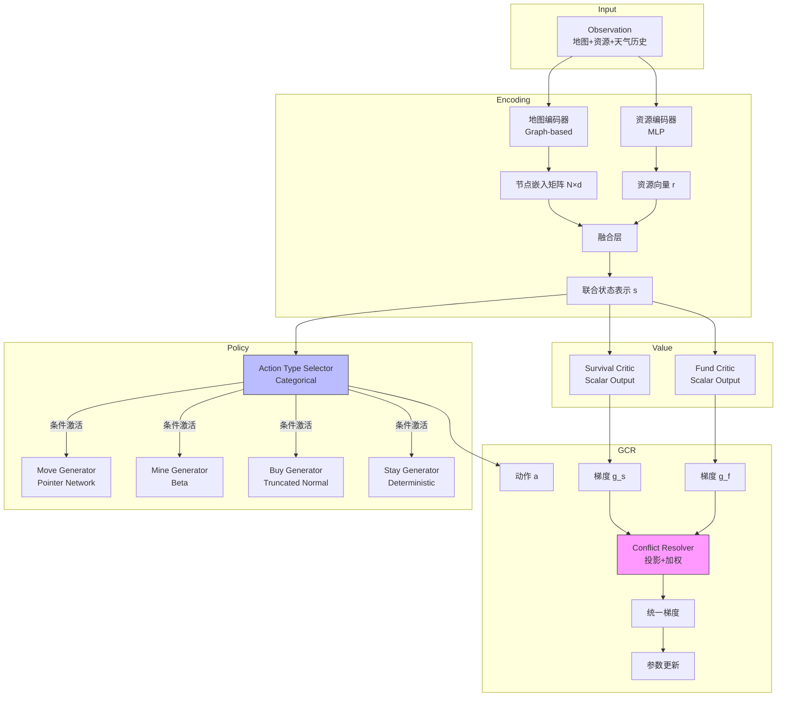

---
## 1. 整体架构



---

## 2. 组件详细设计

### 2.1 地图编码器（3 种工程方案）

| 方案 | 结构 | 适用场景 | 复杂度 |
|------|------|---------|--------|
| **A. 手工特征** | `[距离终点, 距离矿山, 邻接数]` 直接拼接 | 快速验证/固定地图 | O (1) |
| **B. GNN** | 3 层 GraphSAGE/GAT，节点特征=地点类型 | 中等规模/静态拓扑 | O (E) |
| **C. Graph Transformer** | 局部 GNN+全局 Transformer 注意力 | 长程依赖/复杂拓扑 | O (N²) |

Graph-Mamba

GAT

**输入**：
- 节点：地点类型 (one-hot 4 维) + 坐标 (2 维) + 天气历史 (压缩后 8 维)
- 边：通行天数 (1 维) + 基础消耗 (1 维)

**输出**：节点嵌入矩阵 $N \times d$ + 全局上下文向量 $s_{global}$

### 2.2 资源编码器

```python
ResourceEncoder:
- Input: [water, food, money, max_day, current_day] (6维)
- Layer1: Linear(6, 64) + LayerNorm + ReLU
- Layer2: Linear(64, 64) + LayerNorm
- Output: r (64维)
```

### 2.3 融合层（3 种工程方案）

| 方案                  | 实现                                                  | 特点          |    
| ------------------- | --------------------------------------------------- | ----------- | --- | 
| **Concat**          | $s = [n_{current}                                   | 简单直接，适合快速迭代 | 
| **Cross-Attention** | $s = \text{Attention}(Q=r, K=N, V=N)$               | 资源动态选择关注地点  |
| **Gate Fusion**     | $s = \sigma(W_g r) \odot n_{current} + (1-\sigma)r$ | 自适应加权，可解释性强 | 
| Global Node         |  需要整体融合地图编码器和资源编码器                                                   |             | 

### 2.4 Action Type Selector

```python
Input: s (联合状态)
Structure:
- Linear(d, 128) + ReLU
- Linear(128, 4)  # 4类: Move/Mine/Buy/Stay
- Mask: 根据环境规则置非法类型为-inf (沙暴天mask Move)
- Output: Categorical分布 π_type(a|s)
Sampling: Gumbel-Softmax (训练) / Argmax (推理)
```

### 2.5 条件参数生成器（互斥激活）

**Move Generator**（仅当 Type=Move 时计算）：
```python
Input: s, current_node_id, NodeEmbeds N×d
Structure:
- Query: Linear(s, d)
- Keys: NodeEmbeds[neighbors]  # 仅邻居节点，动态长度k
- Scores: Query × Keys^T / sqrt(d)
- Mask: 非邻居节点排除
- Output: Categorical over k neighbors
```

**Mine Generator**（仅当 Type=Mine 时计算）：
```python
Input: s
Structure:
- Linear(s, 64) + ReLU
- Linear(64, 2)  # alpha, beta for Beta分布
- Output: Beta(α, β) ∈ [0,1] 表示挖矿强度(0=不挖, 1=全力)
- Constraint: 若资源<阈值，强制输出0（硬截断）
```

**Buy Generator**（仅当 Type=Buy 时计算）：
```python
Input: s, max_water, max_food
Structure:
- Linear(s, 64) + ReLU
- Linear(64, 4)  # μ_w, σ_w, μ_f, σ_f
- Distribution: TruncatedNormal(μ, σ, 0, 1)
- Output: (water_ratio × max_water, food_ratio × max_food)
- Gradient: 通过ratio回传，max_*视为常数(stop_grad)
```

**Stay Generator**：确定性输出 None，无参数。

### 2.6 双 Critic 架构

```python
SurvivalCritic:
- Input: s
- Structure: Linear(d, 128) + ReLU + Linear(128, 1)
- Output: V_s(s) ∈ [0, 1] (Sigmoid)
- Loss: BCE(V_s, 1_if_reached_else_0)

FundCritic:
- Input: s
- Structure: Linear(d, 128) + ReLU + Linear(128, 1)
- Output: V_f(s) ∈ ℝ (Linear)
- Loss: MSE(V_f, final_money)
- Bootstrap: γ=1.0 (无折扣)
```

### 2.7 GCR 模块

```python
Inputs: 
- g_s = ∇J_survival (Survival Critic梯度)
- g_f = ∇J_fund (Fund Critic梯度)
- α = PriorityScheduler(s) ∈ [0,1] (动态权重)

Process:
1. cos_sim = cosine_similarity(g_s, g_f)
2. if cos_sim < 0:
     proj = (g_f · g_s) / ||g_s||²
     g_f_corrected = g_f - proj × g_s
   else:
     g_f_corrected = g_f
3. g_total = α × g_s + (1-α) × g_f_corrected

Output: g_total (用于更新Actor参数)
```

**PriorityScheduler**：
- Input: [water_ratio, food_ratio, distance_to_end]
- Logic: 资源<20% → α=0.9; 资源>50% → α=0.3; else α=0.5

---

## 3. 数据流与维度

| 阶段 | 张量 | 维度 | 备注 |
|------|------|------|------|
| Input | 地图节点特征 | $N \times 6$ | 类型+坐标 |
| Input | 资源状态 | $6$ | 水/食/钱/天数 |
| Encoding | 节点嵌入 | $N \times d$ | d=64/128 |
| Encoding | 资源嵌入 | $64$ | r |
| Fusion | 联合状态 | $d_{joint}$ | 128-256 |
| Policy | Type Logits | $4$ | Move/Mine/Buy/Stay |
| Policy | Move Params | $k_{neighbors}$ | 变长 |
| Policy | Mine Params | $2$ | α, β |
| Policy | Buy Params | $4$ | μ_w, σ_w, μ_f, σ_f |
| Value | V_s, V_f | $1$ each | 标量 |

---

## 4. 训练配置

**优化器**：
- Actor + Type Selector: Adam, LR=1 e-4
- Dual Critics: Adam, LR=2 e-4 (Critic 更快)
- Graph Encoder: Adam, LR=5 e-5 (如果预训练则冻结)

**关键超参数**：
- PPO Clip: ε=0.2
- GAE: γ=0.99, λ=0.95
- Target KL: 0.02 (早停阈值)
- Entropy Coef: 0.1 (Type Selector), 0.01 (Param Generators)

**稳定性技巧**：
- Gradient Clipping: max_norm=0.5
- Value Clipping: 与旧价值差异<0.5
- 预训练: Graph Encoder 先进行路径预测任务预训练 100 epoch

---

## 5. 工程取舍速查

| 决策点        | 方案 A (轻量) | 方案 B (平衡)        | 方案 C (重型)         |
| ---------- | --------- | ---------------- | ----------------- |
| **地图编码**   | 手工 3 特征   | 3 层 GNN          | Graph Transformer |
| **资源融合**   | Concat    | Cross-Attention  | Global Node       |
| **动作参数**   | 全部离散化     | 分层条件生成 (本文)      | 混合整数规划            |
| **Critic** | 共享网络双头    | 分离网络 (本文)        | 独立优化器+延迟更新        |
| **探索策略**   | ε-贪婪      | Entropy + Gumbel | 内在奖励 (RND)        |
