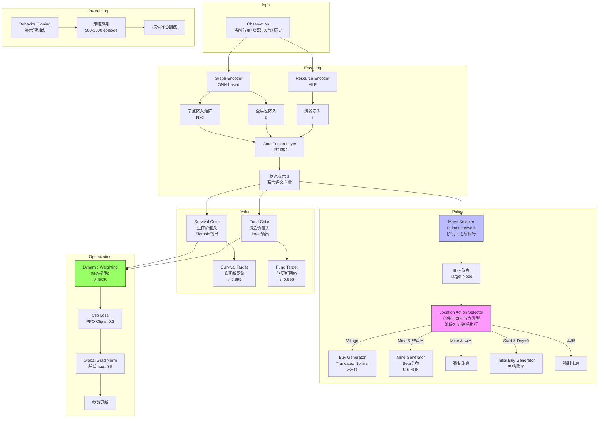

**沙漠问题 RL 架构设计文档（Hard Selector + GNN 版）**

---

## 0. 实现状态（2026-02-27）

### 0.1 已落地组件

- 编码模块：`ResourceEncoder`、`ManualGNN`、`GateFusion`
- 策略模块：`MoveSelector`、`LocationActionSelector`、`Buy/Mine/InitialBuy` 生成器
- 价值模块：`SurvivalCritic`、`FundCritic`、`TargetNetwork`（软更新）
- 优化模块：PPO 已接入 `dynamic_alpha` 动态加权
    - 训练日志输出 `alpha_mean`、`survival_value_loss`、`fund_value_loss`
- 训练编排：Stage2/Stage3 自动化已接入（阈值切换 + alpha覆盖 + 断点续训阶段上下文）

### 0.2 Pipeline 验证结果

- 覆盖范围：train / pretrain / evaluate / benchmark / validator
- 验证方式：单元与冒烟测试
- 结果：54/54 通过

### 0.3 当前未纳入本轮实现

- Stage1 仍为手动分离流程（按项目约定，不额外自动化）
- 文档中的 GAT 具体注意力实现当前以 `ManualGNN` 聚合版本落地

---

## 1. 整体模型架构概览



---

## 2. 核心组件详细设计

### 2.1 Graph Encoder（GNN 模块）

**功能**：将地图拓扑结构编码为节点级和全局级表征。

**输入**：
- 地图节点特征 $X \in \mathbb{R}^{N \times F_n}$：包含地点类型（one-hot 4维）、坐标（2维）、天气历史编码（8维）
- 边特征 $E \in \mathbb{R}^{M \times F_e}$：通行天数（1维）、基础消耗（1维）、边类型（沙漠/捷径等，2维）
- 当前位置标记 $c \in \{0, ..., N-1\}$

**架构设计**：
- **类型**：GraphSAGE 或 GAT（Graph Attention Network），选用 GAT 以捕获邻居重要性差异
- **层数**：3 层，每层隐藏维度 64
- **聚合方式**：均值聚合（GraphSAGE）或注意力加权（GAT）
- **残差连接**：层间添加残差，防止 over-smoothing

**输出**：
- **节点嵌入矩阵** $H \in \mathbb{R}^{N \times d}$：每个地点的上下文感知表征（含拓扑位置、可达性信息）
- **全局图嵌入** $g \in \mathbb{R}^{d}$：通过全局平均池化 + MLP 获得，表示整体地图状态

**特殊处理**：
- **距离感知位置编码**：在节点特征中加入到终点和矿山的图距离（最短路径长度），作为 GNN 的辅助特征（帮助 GNN 快速收敛）

---

### 2.2 Resource Encoder（资源编码器）

**功能**：编码玩家当前资源状态，与地图表征分离以保持全局性。

**输入**：
- 当前水量 $w \in [0, W_{max}]$
- 当前食物量 $f \in [0, F_{max}]$
- 当前资金 $m \in \mathbb{R}$
- 当前天数 $t \in [0, T_{max}]$
- 剩余天数 $T_{max} - t$

**架构**：
- 两层 MLP：输入(6维) → 隐藏(64维) → 输出(64维)
- **归一化**：输入前做 Min-Max 归一化（水量/最大负重，资金/初始资金等）
- **激活**：ReLU + LayerNorm（稳定训练）

**输出**：资源嵌入向量 $r \in \mathbb{R}^{64}$

---

### 2.3 Gate Fusion Layer（门控融合层）

**功能**：动态融合图结构信息、全局状态和资源状态，决定"在当前地图和资源状况下，哪些信息更重要"。

**输入**：
- 当前节点嵌入 $h_c \in \mathbb{R}^{d}$（从 $H$ 中索引当前位置）
- 全局图嵌入 $g \in \mathbb{R}^{d}$
- 资源嵌入 $r \in \mathbb{R}^{64}$

**机制**：
```
# 门控计算
gate_input = Concat[h_c, g, r]
z = Sigmoid(MLP(gate_input))  # 门控向量 [0,1]

# 加权融合
fused = z ⊙ MLP_map(Concat[h_c, g]) + (1-z) ⊙ MLP_res(r)

# 后续处理
s = LayerNorm(fused)  # 联合状态表示
```

**设计意图**：
- 当资源紧张（水<20%）时，门控自动偏向资源嵌入（关注生存）
- 当资源充裕时，门控偏向图嵌入（关注路径规划）

---

### 2.4 Move Selector（移动选择器 / Pointer Network）

**阶段**：**必须执行**（每天第一步）

**功能**：在当前位置的所有邻接节点中选择移动目标（包括停留，即选择自身）。

**输入**：
- 联合状态表示 $s \in \mathbb{R}^{d_{joint}}$
- 当前节点嵌入 $h_c$
- 邻居节点嵌入集合 $\{h_j\}_{j \in \mathcal{N}(c)}$（从 GNN 输出 $H$ 中动态索引）

**架构（Pointer Network）**：
- **Query 生成**：$q = W_q \cdot s \in \mathbb{R}^{d}$
- **Key 生成**：$k_j = W_k \cdot h_j \in \mathbb{R}^{d}$（对每个邻居）
- **注意力得分**：$\alpha_j = \frac{q^T k_j}{\sqrt{d}}$（缩放点积）
- **掩码处理**：
  - 沙暴天：非当前节点的 $\alpha_j \to -\infty$（强制停留）
  - 负重检查：若移动后资源检查失败（理论上不应发生，作为保险）

**输出**：
- 目标节点分布：Categorical($\pi_{move}$)  over 邻居节点
- 采样结果：目标节点 ID $j_{target}$

**梯度**：通过 Gumbel-Softmax 或 REINFORCE 传递梯度到选择机制。

---

### 2.5 Location Action Selector（到达动作选择器）

**阶段**：**条件执行**（每天第二步，到达目标节点后）

**触发条件**：根据 Move Selector 输出的 $j_{target}$ 类型决定：

**条件分支设计**：

| 目标地点类型 | 条件检查 | 激活生成器 | 说明 |
|-------------|---------|-----------|------|
| **Village** | 无条件 | **Buy Generator** | 可购买（包括买0） |
| **Mine** | `is_arrival == False`（昨日也在此） | **Mine Generator** | 连续停留可挖矿 |
| **Mine** | `is_arrival == True`（今日刚达） | **强制休息** | 规则限制到达当日不可挖 |
| **Start** | `Day == 0` | **Initial Buy Generator** | 第0天初始购买 |
| **Start** | `Day > 0` | **强制休息** | 回到起点无动作 |
| **Other/End** | 无条件 | **强制休息** | 普通地点或终点 |

**实现细节**：
- 通过 `switch-case` 或 `if-elif` 结构实现条件路由
- 强制休息分支无网络参数，直接返回零动作
- 每个生成器只接收与其相关的状态子集（如 Buy Generator 额外接收资金上限信息）

---

### 2.6 Buy Generator（购买生成器）

**触发**：到达 Village 或 Day=0 Start

**功能**：生成购买量（水 + 食物）。

**输入**：联合状态 $s$，最大可购买量 $max\_w, max\_f$（由资金和负重计算）

**架构**：
- **比例预测**：输出购买比例 $\rho_w, \rho_f \in [0,1]$（Truncated Normal 分布）
- **缩放**：$water = \rho_w \times max\_w$，$food = \rho_f \times max\_f$
- **约束保证**：通过分布截断确保 $water \leq max\_w$，$food \leq max\_f$，且 $water + food \leq capacity$

**输出**：
- 动作参数：$(buy\_water, buy\_food)$
- 对数概率：用于 PPO 重要性采样比计算

---

### 2.7 Mine Generator（挖矿生成器）

**触发**：在 Mine 且非到达当日

**功能**：决定挖矿强度（挖多少/是否挖）。

**输入**：联合状态 $s$

**架构**：
- **Beta 分布**：输出 $\alpha, \beta$ 参数
- **解释**：采样值 $intensity \in [0,1]$
  - $intensity = 0$：休息（消耗基础资源）
  - $intensity = 1$：全力挖矿（消耗 3×基础资源，获得基础收益）
  - 中间值：部分挖矿（线性插值消耗和收益）

**特殊处理**：
- 若资源不足（水 < 挖矿所需最低量），强制输出 0（硬截断）

---

### 2.8 Dual Critic Architecture（双价值网络）

**分离设计**：两个独立的价值头，共享底层编码或完全分离（推荐完全分离以避免表示冲突）。

**Survival Critic（生存评论家）**：
- **任务**：预测从当前状态出发，成功到达终点的概率
- **输出**：$V_s(s) \in [0,1]$（Sigmoid）
- **损失**：Binary Cross-Entropy
- **目标值**：蒙特卡洛回报（Episode 结束时 1/0）
- **引导（Bootstrap）**：$\gamma = 0.99$，GAE $\lambda = 0.95$

**Fund Critic（资金评论家）**：
- **任务**：预测最终剩余资金（含终点退款）
- **输出**：$V_f(s) \in \mathbb{R}$（Linear）
- **损失**：MSE
- **目标值**：实际最终资金
- **折扣**：$\gamma = 1.0$（资金无时间折扣）

**Target Network（目标网络）**：
- 为两个 Critic 各维护一个 Target Network（软更新：$\tau = 0.995$）
- 用于计算 TD Target，稳定训练

---

## 3. 优化与训练策略

### 3.1 Dynamic Weighting（动态加权，替代 GCR）

**机制**：不使用梯度投影，而是根据资源状态动态调整损失权重。

**权重计算**：
```
if water < 20% or food < 20%:
    alpha = 0.9  # 生存优先
elif distance_to_end < 3 days:
    alpha = 0.1  # 接近终点，激进优化资金
else:
    alpha = 0.5  # 平衡模式

Total_Loss = alpha * Loss_Survival + (1-alpha) * Loss_Fund
```

**优势**：无梯度削减，实现简单，超参数少（仅需定义状态-权重映射）。

### 3.2 训练 Pipeline（三阶段）

**Stage 1: Behavior Cloning（BC Warmup）**
- 使用启发式策略（如最短路径 + 保守购买）生成 1000 条成功轨迹
- 训练 Move Selector 和 Buy Generator（仅模仿，无强化学习）
- 目标：让模型学会基础生存策略（成功率 > 80%）

**Stage 2: PPO Fine-tuning（单目标）**
- 冻结 Fund Critic，仅优化 Survival Critic（或权重 alpha=0.9 固定）
- 让模型巩固生存策略，Critic 估计稳定

**Stage 3: Multi-Objective PPO**
- 激活双 Critic，使用 Dynamic Weighting
- 逐步降低生存权重（alpha 从 0.9 降到 0.3），让模型学习资金优化

### 3.3 稳定性技巧

- **Gradient Clipping**：全局梯度范数裁剪至 max_norm=0.5
- **Value Clipping**：Critic 更新时限制与旧值的差异（<0.5）
- **Entropy Regularization**：Move Selector 使用较高熵系数（0.1）鼓励探索路径；Location Action 使用低熵（0.01）稳定动作
- **KL Early Stopping**：策略更新后若 KL > 0.02，停止当前轮更新

---

## 4. 关键设计决策总结

| 设计点 | 选择 | 理由 |
|-------|------|------|
| **图编码** | GNN (3层GAT) | 捕获地图拓扑，支持 Pointer Network 查询 |
| **动作选择** | Hard Selector | 严格保证规则（到达才能买，沙暴必须停），避免无效探索 |
| **多目标** | 双 Critic + 动态加权 | 避免 GCR 的梯度削减问题，实现简单稳定 |
| **价值估计** | Target Network | 稳定 TD 学习，必须组件 |
| **冷启动** | BC Warmup | 解决初期全死问题，为强化学习提供良好初始化 |
| **融合策略** | Gate Fusion | 自适应平衡地图信息与资源信息，优于简单拼接 |
